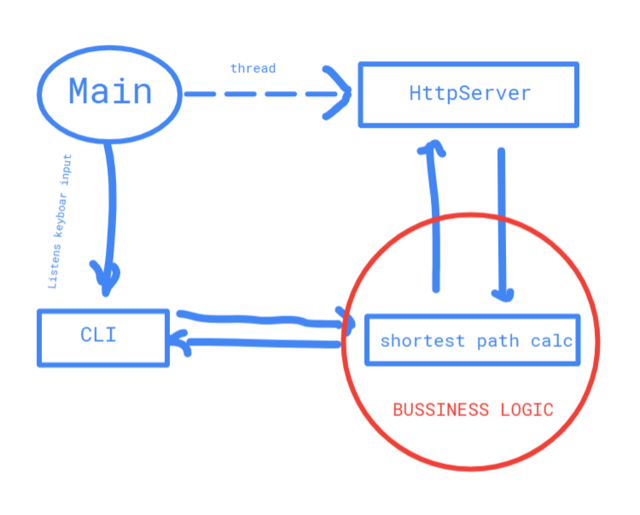

#### Requirement to RUN Bexcolar.com
To run Bexcolar.com its required [JRE 8](https://www.oracle.com/technetwork/pt/java/javase/downloads/jre8-downloads-2133155.html?printOnly=1).
```sh
$ java -jar bexcolar.com-1.0-SNAPSHOT.jar /absolute/path/input-file.csv 
```
#### Requirements to COMPILE Bexcolar.com
To clone and compile Bexcolar.com its required:
* [JDK 8](https://www.oracle.com/technetwork/pt/java/javase/downloads/jre8-downloads-2133155.html?printOnly=1)
* [Gradle](https://gradle.org/)
* [Git](https://git-scm.com/)

```sh
$ git clone https://github.com/mauricarvalho/bexcolar.com.git
$ mkdir bexcolar.com && cd bexcolar.com
$ ./gradlew build
$ java -jar bexcolar.com-1.0-SNAPSHOT.jar /absolute/path/input-file.csv 
```

### Code Structure
The folder are organized in the following way:

| Folder | Info |
| ------ | ------ |
| dijkstra | Contains the main bussiness logic, which calculates the shortest path using Dijkstra algorithm |
| main | Main class, the application entry point |
| models | domain models |
| modules | divided by cli module(command line) and rest module(http server) |
| utils| common utility logic, constants and file operations(csv) |

### Architecture


### Rest Api Usage
Listening on port: *8084*

Show best route between two airports:
```sh
GET  api/bex/route?src=GRU&dst=VCP
```
Adding routes:
```sh
POST  api/bex/route
BODY  {"src":"GRU","dst":"VCP","weight":"5"}
```
